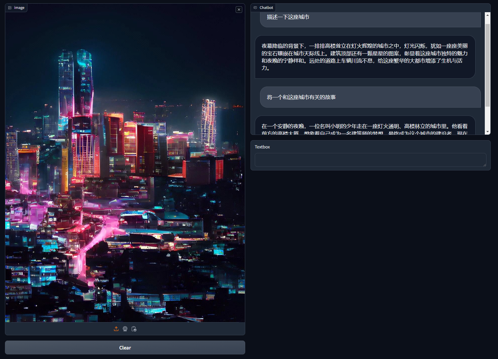
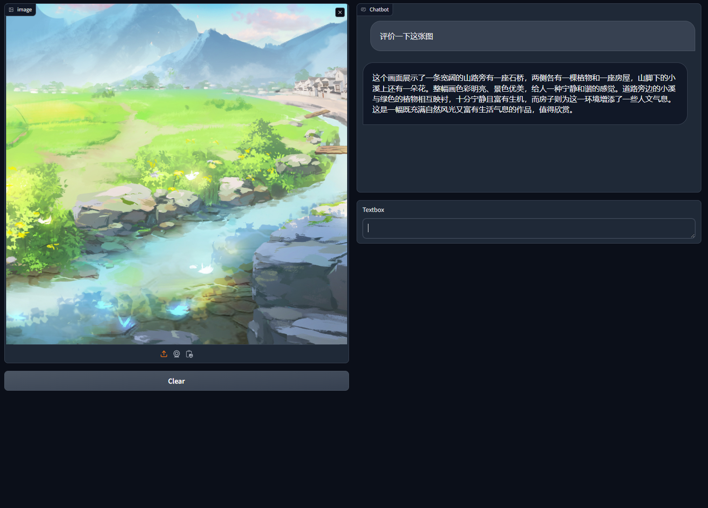

# How to train a VLM

这是一个视觉多模态大模型构建以及训练的笔记，用于学习以及理解多模态大模型。

## 代码说明

LLM使用了Qwen-7B作为主体，相关的代码在qwen文件夹下，通过重写QWenModel的forward来实现多模态特征的注入。

视觉主干使用CLIP_VIT，相关代码在visual文件夹下，其中还包含其他主干网络。

VLM模型在model文件夹下model.py文件中。

数据预处理在dataprocess文件夹下，数据集相关代码在dataset文件夹下。

## 构建

VLM中视觉部分采用已经实现初步语义对齐的CLIP模型，具体为：clip-vit-large-patch14，使用两层MLP进行特征映射（实际上一层也是可以的，已经对齐过的视觉模型更多需要的是调整映射中心）。通过重写QWenModel的forward，将对应的image标记替换为视觉特征。

## 训练

数据使用了多语言数据，这里主要为COCO2017数据集以及AI Challenger图像中文描述数据集。COCO数据集的标注使用了LLAVA的complex_reasoning_77k，该标注可以有效提升模型的描述丰富度。AI Challenger使用原始标注，并使用固定prompt。

### 数据预处理

数据预处理主要包括路径合并，QA数据拼接，特征插入token处理等。

### 训练

模型训练采用image model冻结的方式进行，LLM使用Lora方式训练来减少训练压力。需要训练的参数包括视觉特征映射层以及LLM中Lora的参数。由于映射层是未训练的初始化参数，所以为了平衡模型参数优化速度，这里为映射层设定了比Lora部分更大的学习率。

## 使用

提供了webUI

| ||
|---|---|

### 运行环境

安装pytorch并使用pip install 安装 requirements.txt
```shell
pip install torch==2.1.2 torchvision==0.16.2 torchaudio==2.1.2 --index-url https://download.pytorch.org/whl/cu121
pip install -r requirements.txt
```

### 训练

下载相关数据
|AIC|COCO|
|---|---|
|https://tianchi.aliyun.com/dataset/145781|http://images.cocodataset.org/zips/train2017.zip

使用config.yaml配置数据路径，并使用process_image.py进行预处理。
运行根目录 train.bat/train.sh，可自行配置相关参数进行试验。